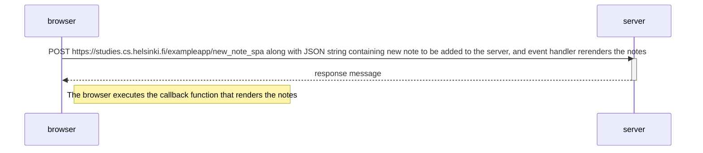

```mermaid
sequenceDiagram
    participant browser
    participant server

    browser->>server: POST https://studies.cs.helsinki.fi/exampleapp/new_note_spa along with JSON string containing new note to be added to the server, and event handler rerenders the notes
    activate server
    server-->>browser: response message
    deactivate server

    Note right of browser: The browser executes the callback function that renders the notes
```